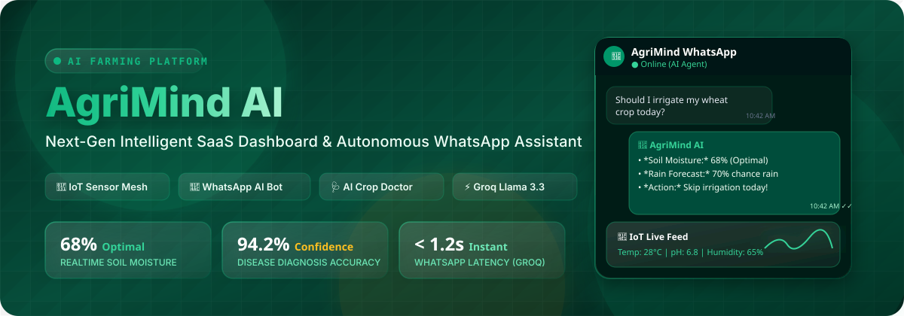
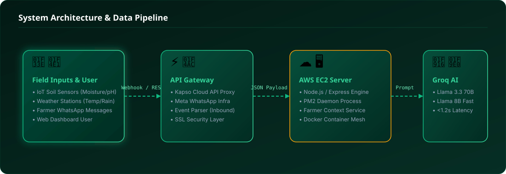

<div align="center">

  

  <br/><br/>

  <!-- PROMINENT CTA BUTTONS -->
  <p align="center">
    <a href="https://ai-farming-assistant-nu.vercel.app/" target="_blank">
      
    </a>
    &nbsp;&nbsp;
    <a href="https://wa.me/12028528477?text=Hi" target="_blank">
      
    </a>
  </p>

  <br/>

  # 🌾 AgriMind — AI Farming Assistant & Autonomous WhatsApp Platform

  **Empowering Modern Agriculture with Real-time IoT Sensors, AI Crop Diagnostics, and 24/7 WhatsApp AI Advisory.**

  [](https://reactjs.org/)
  [](https://vitejs.dev/)
  [](https://tailwindcss.com/)
  [](https://groq.com/)
  [](https://api.kapso.ai/)
  [](https://www.docker.com/)
  [](https://aws.amazon.com/)

  <p align="center">
    <a href="#-quick-start"><b>Quick Start</b></a> •
    <a href="#-whatsapp-bot-integration"><b>WhatsApp Bot</b></a> •
    <a href="#-system-architecture"><b>Architecture</b></a> •
    <a href="#-key-features"><b>Features</b></a> •
    <a href="#-docker-deployment"><b>Docker</b></a> •
    <a href="#-tech-stack"><b>Tech Stack</b></a>
  </p>

</div>

---

> 💡 **AgriMind** is an end-to-end intelligent agricultural platform designed to bridge the technology gap for smallholder and commercial farmers. It combines a premium **[React + Vite SaaS Dashboard](https://ai-farming-assistant-nu.vercel.app/)** for deep farm analytics with an **[Autonomous WhatsApp AI Agent (+1 202-852-8477)](https://wa.me/12028528477?text=Hi)** powered by Groq's high-speed Llama 3.3 70B & 8B LLMs, providing actionable farming advice in real time.

---

## 🌟 Key Features

<table>
  <tr>
    <td width="50%" stroke="1">
      <h3 align="center">💬 Autonomous WhatsApp AI Bot</h3>
      <p>Connects farmers directly to an AI advisor on WhatsApp. Features instant Groq inference (&lt;1.2s response time), <b>double blue tick read receipts</b>, and <b>live typing indicators</b> for a natural chat experience.</p>
    </td>
    <td width="50%">
      <h3 align="center">📊 Real-Time IoT Sensor Mesh</h3>
      <p>Monitors <b>soil moisture, pH levels, temperature, and humidity</b> in real time with animated live sparklines (<code>PulseWave</code>), 24-hour historical trend charts, and automated threshold alerts.</p>
    </td>
  </tr>
  <tr>
    <td width="50%">
      <h3 align="center">🩺 AI Crop Doctor &amp; Diagnostics</h3>
      <p>Instant drag-and-drop leaf disease diagnosis powered by computer vision prompts, presenting an animated confidence score bar and step-by-step treatment &amp; pesticide recommendations.</p>
    </td>
    <td width="50%">
      <h3 align="center">🎙️ Voice-Activated AI Assistant</h3>
      <p>Hands-free voice interaction for field conditions. Includes animated pulse-ring microphone state, speech-to-text transcript processing, and audio response playback.</p>
    </td>
  </tr>
  <tr>
    <td width="50%">
      <h3 align="center">🌤️ Microclimate Weather Radar</h3>
      <p>7-day localized weather forecast, hourly breakdown, and interactive rain-probability bar charts to optimize irrigation and fertilizer application schedules.</p>
    </td>
    <td width="50%">
      <h3 align="center">💰 Farm Cost &amp; Yield Estimator</h3>
      <p>Comprehensive financial planning module with pie-chart cost breakdowns, ROI projections, and AI-generated task prioritization lists for max yield efficiency.</p>
    </td>
  </tr>
</table>

---

## 🏗️ System Architecture

The AgriMind platform operates on a decoupled architecture where IoT sensors and WhatsApp events stream into a lightweight AWS EC2 microservice daemon, which orchestrates live context retrieval and queries Groq's ultra-low latency LLM inference.

<div align="center">
  
</div>

### 🔄 Data Pipeline Flow
1. **Inbound Trigger:** A farmer sends a message on WhatsApp or an IoT sensor passes a critical threshold (e.g. soil moisture drop).
2. **Gateway Processing:** Kapso Cloud API Proxy forwards the webhook to our AWS EC2 Express backend server.
3. **Context Injection:** `processMessage()` aggregates live telemetry (soil moisture, rain forecast, crop type, location context).
4. **Groq AI Inference:** Prompt with live farmer context is sent to `llama-3.1-8b-instant` / `llama-3.3-70b-versatile` via Groq SDK.
5. **WhatsApp Delivery:** Actionable advice with single-asterisk bold formatting and clean line spacing is sent back to WhatsApp instantly.

---

## 🚀 Quick Start

### Prerequisites
- **Node.js**: `v18.x` or `v20.x`
- **npm**: `v9.x` or higher
- **Git**

### 1. Clone the repository
```bash
git clone https://github.com/stack-rishi/AI-Farming-Assistant.git
cd AI-Farming-Assistant
```

### 2. Frontend Development Server
```bash
# Install dependencies
npm install

# Start Vite hot-reload server
npm run dev
```
Open your browser at **`http://localhost:5173`**.

### 3. Production Build & Preview
```bash
npm run build
npm run preview
```

---

## 💬 WhatsApp Bot Integration

The standalone WhatsApp backend service is located inside the `whatsapp-bot/` directory.

### Environment Configuration (`whatsapp-bot/.env`)
Create a `.env` file inside `whatsapp-bot/`:

```env
# Kapso Credentials (AgriMind Dedicated WhatsApp Line)
KAPSO_API_KEY=your_kapso_api_key_here
KAPSO_PHONE_NUMBER_ID=1179330158605218

# Free Groq API Key (Llama 3.3 70B / 8B Models)
GROQ_API_KEY=gsk_your_groq_api_key_here

# Server Port
PORT=3001
```

### Running Locally
```bash
cd whatsapp-bot
npm install
npm start
```

### Deploying to Production (AWS EC2 + PM2)
```bash
# SSH into EC2 instance
ssh -i "your-key.pem" ec2-user@your-ec2-ip

# Pull latest code & restart PM2 daemon
cd ~/agrimind-bot
git pull origin main
pm2 restart agrimind-bot --update-env
```

---

## 🐳 Docker Deployment

AgriMind includes full multi-stage Docker support for both development and production environments.

### Production (Nginx-Served Static SPA — Recommended)
```bash
docker compose up --build -d
```
> App runs at **`http://localhost:8080`** served via lightweight `nginx:1.27-alpine` with client-side route fallback (`try_files ... /index.html`), gzip compression, and long-term caching.

### Development (Hot-Reload Container)
```bash
docker compose --profile dev up --build app-dev
```
> App runs at **`http://localhost:5173`** with host volume mounting for live file updates.

---

## 📂 Project Structure

```text
Ai-Farming-Assistant/
├── assets/
│   └── readme/               # SVG Header Banners & Architecture Diagrams
├── whatsapp-bot/             # Standalone WhatsApp Backend Microservice
│   ├── services/
│   │   ├── aiService.js      # Groq Llama 3.3 / 8B AI Engine & Prompt System
│   │   └── dashboardService.js # Mock Live IoT Telemetry & Farmer Context Provider
│   ├── config.js             # Environment Config Mapper
│   └── index.js              # Express Webhook Handler & Kapso API Controller
├── src/                      # Frontend SaaS Application (React + Vite)
│   ├── components/
│   │   ├── chat/             # Floating & Page AI Chat Assistant Widget
│   │   ├── common/           # Reusable UI Components (Card, Badge, PulseWave)
│   │   ├── cropdoctor/       # AI Image Disease Diagnosis Dropzone
│   │   ├── dashboard/        # Main Farm Overview, Stat Cards & Sensor Grid
│   │   ├── iot/              # Live Sensor Cards, History Chart & Alerts
│   │   ├── layout/           # Sidebar Navigation & Topbar Header
│   │   └── weather/          # Weather Radar, Forecast & Rain Prediction
│   ├── data/
│   │   └── mockApi.js        # Decoupled Async API Layer (Promise-wrapped)
│   ├── pages/                # 10 Dedicated Sidebar Navigation Pages
│   ├── App.jsx               # React Router Definitions
│   └── main.jsx              # Application Entry Point
├── Dockerfile                # Multi-stage Node build + Nginx server
├── Dockerfile.dev            # Development hot-reload image
├── docker-compose.yml        # Docker compose service configurations
├── nginx.conf                # SPA-aware Nginx configuration
├── tailwind.config.js        # Forest Green Custom Agriculture Palette
└── README.md                 # Project Documentation
```

---

## 🛠️ Tech Stack & Dependencies

| Layer | Technologies Used |
| :--- | :--- |
| **Frontend Framework** | React 18, Vite 5, React Router DOM 6 |
| **Styling & Icons** | Tailwind CSS 3, Lucide React, Custom Forest Palette |
| **Data Visualization** | Recharts (Live Telemetry, Rain Charts, Cost Pie Graphs) |
| **Animations** | Framer Motion (Page Transitions, Micro-interactions) |
| **AI Inference** | Groq SDK (`llama-3.1-8b-instant` / `llama-3.3-70b-versatile`) |
| **WhatsApp Integration** | Kapso Cloud API Proxy (Official Meta WhatsApp Proxy) |
| **Backend & Cloud** | Node.js, Express, AWS EC2, PM2 Process Manager |
| **DevOps & Containers** | Docker, Docker Compose, Nginx Alpine |

---

## 🎨 Design System & Color Tokens

AgriMind uses a purpose-built **Forest Green & Earth** color system designed for outdoor readability and natural agricultural themes:

```javascript
// tailwind.config.js custom colors
forest: {
  50:  '#f0fdf4', // Background highlight
  500: '#22c55e', // Optimal state
  700: '#15803d', // Primary agriculture brand green
  900: '#14532d', // Deep header contrast
  950: '#052e16', // Sidebar dark background
}
```

* **Status Colors:** Clay/Amber for *"Needs Attention"*, Sky Blue for *"Moisture & Rainfall"*, Berry/Rose for *"Temperature Alerts"*.
* **Typography:** `Plus Jakarta Sans` (Headings & Data Display), `Inter` (Body Copy), `JetBrains Mono` (Sensor Values).

---

## 📄 License & Contributing

Distributed under the **MIT License**. See `LICENSE` for more information.

Contributions, issues, and feature requests are welcome! Feel free to check the [issues page](https://github.com/stack-rishi/AI-Farming-Assistant/issues).

<div align="center">
  <sub>Built with ❤️ for global farmers by the AgriMind Team.</sub>
</div>